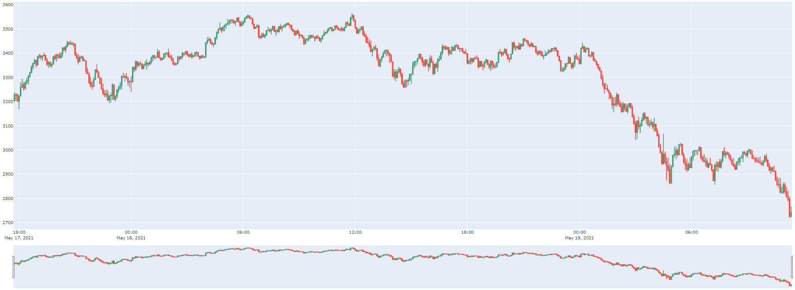
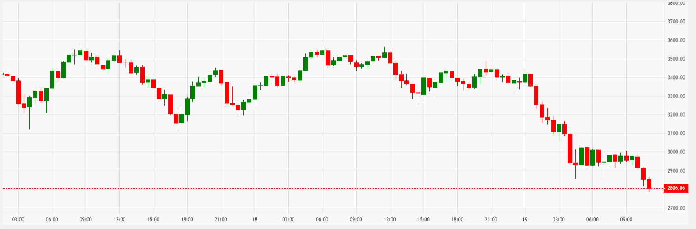

# Live trader and trading-visualizer

### Prerequisites 
1. git clone [repo](https://github.com/davidmickev/trading-visualizer.git)
2. Python 3.xx
3. pip

### Setup
1. open work dir, create venv for python if needed.
2. pip install -r requirements.txt

### Running Flask BackEnd Visualizer
1. set FLASK_APP=backend.py
2. flask run

# Public Implementations Description.

1. Utilizing BinanceAPI for requests and account access.
2. Get live data via desired indicator/frequency via live socket.
3. Implemented visualization with JS / LightWeightCharts.
4. Implemented visualization and Dash and plotly.
5. Implemented live visualization JS
6. Flask backend to direct JS visuals

Dash

Flask JS/ LightWeightCharts

Picture above will update a new candle live and close the candle when the specified ticker that is set time expires.

## TBA / Notes / Work in Progress

1. Trade functionalities are currently excluded from public version.
2. Trade indicators and studies are performed by https://github.com/mrjbq7/ta-lib/blob/master/README.md in addition to personal configurations.
3. Releasing generic public TA Lib examples by May EOM.
4. Generic trade functionality examples will be provided May EOM.
5. Uploading different graph models with included technical analasys indicators on current plots.
6. Releasing some research behind TA Lib correlations.
